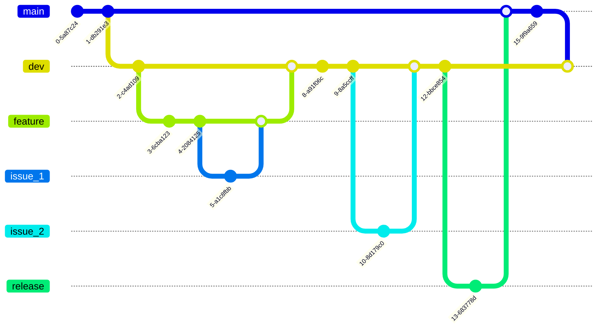

# Recapped for Unidays 

[TOC]

## Project Contributors

| Name                          | Email                    |
| :---------------------------- | ------------------------ |
| Lewis Evans (Team Leader)     | psyle2@nottingham.ac.uk  |
| Jakub Sobolewski (Team Admin) | psyjs34@nottingham.ac.uk |
| Luke Cunningham (Git Lead)    | psylc12@nottingham.ac.uk |
| Joshua Gaynor                 | psyjg22@nottingham.ac.uk |
| Adrian Nyathi                 | psyan13@nottingham.ac.uk |
| Harry Scott                   | psyhs16@nottingham.ac.uk |
| Zayn Awan                     | psyza6@nottingham.ac.uk  |
| Perfecto Lacuesta             | psypl4@nottingham.ac.uk  |

## Repository Structure

> [!NOTE]
>
> This repo structure is just a draft, please add/remove from it as necessary 

**Root Directory**

* `/docs` contains the project documentation, planning/analysis docs, and meeting notes
* `/src` contains source code
  * `/frontend`
    * `/components` contains react components
    * `/pages` contains page-level components
    * `/styles`  contains CSS
  * `/backend`
    * `api`  contains API logic
  * `/tests` 
    * `/frontend`
    * `/backend`
    * `/integration`

* `/assets` 

  * `/frontend` 
  * `/backend`

* `/dist` contains built files ready for distribution

* `/README.md`

  

## Branch Guidlines

**Illustrative diagram**

*subject to change*

`main` contains the stable, production-ready code. 

* Rules: 
  * **Do Not** push to this branch. 
  * Only merge release branches after testing.

`dev` from main. contains the development code where all feature branches merge. 

* Rules: 
  * All feature branches merge into dev <u>only</u> after code review and testing.

`<feature>` from dev. Contains branches for features.

* Rules: 
  * Create a new feature branch for each new feature.
  * Branch off dev and merge back into dev once <u>only</u> that specific feature is complete.
  * Use descriptive names for the branches e.g. `feature/user-authentication`

`issue_<id>` Fixes identified issues/bugs.

* Rules: 
  * Create branches for fixing specific issues/bugs identified on <u>any</u> branch.
  * After fixing the issue, once reviewed, merge the branch back into the branch it originated from.

`release` from dev. A final branch at the end of 'Development 1' to do final testing before being release/merged into main. (Perhaps also if we have deliverables at the end of each sprint)

* Rules: 
  * Once testing and review is complete Luke will merge into main and tag the release  with the format version-\<major>.\<minor>.\<release> e.g. `version-1.0.0`

## Git Issue Guidlines

Specific guidlines when creating git issues:

1. Create an issue for the part of code that is incorrect, Give title, a label, and description, link it to the function id, as well as any tests that failed because of it. Can include incorrect code and some idea for change

2. Once you want to add a code change for the issue create a new branch, link the issues in the description as `Closes #num \nCloses #num`. If there are multiple issues closely related you may want to use the same branch.
3. Each issue you fix should be its own commit (don't need to push to the server each time).
4. Once all issues are resolved create a merge request, include a reviewer and don't merge until they have approved the merge.
5. Link the merge request in the test's Review link within the TDD table **(We need to create a TDD table)**

> [!TIP]
>
> If a branch for a function exists it may be better to switch to that branch instead of making a new one

## Commit Message Guidelines

* Keep the commit messages concise but descriptive

* Use [Imperative Moods](https://en.wikipedia.org/wiki/Imperative_mood) in the commit message e.g. 'add feature' instread of 'added feature' or 'adding feature'

* Include relevant git issue numbers if relevant (e.g. Fix login error #22 ...)

  

