## Requirement Gathering

Before we started the implementation of the coding of our project, the team decided that we should establish the requirements before hand. We decided have use case diagrams and user stories as our implement for this. The reason  we chose these is so that we can show clearly what the Uni-days user should experience from their perspective. Furthermore,  its use of abstraction makes it easier to show to our industry supervisors which can make sure that our expectation of the project aligns with theirs, therefore reducing the chance of miscommunication in the future. This proved beneficial as we we're able to showcase our requirements to our industry supervisors during a meeting where they understood and approved of them.

## Use case Diagram 

The user can view their recap only after logging in, hence why viewRecap is an extension of Login . The See Total Spent, Total Items Bought, See Most Used Brand, Number of Purchases, Amount Saved, and Most Visited Category use cases are included within the View Recap use case. However, the Share Recap and View Spending Per Month Chart components are not included in the recap. These components can only be accessed after the View Recap use case has been accessed, which is why they are shown as extensions of it. Furthermore, once the Share Recap component is accessed, users can see  their friends' recaps and compare them, which is why they are extensions of it.

## Images of Use Case Test and User Stories

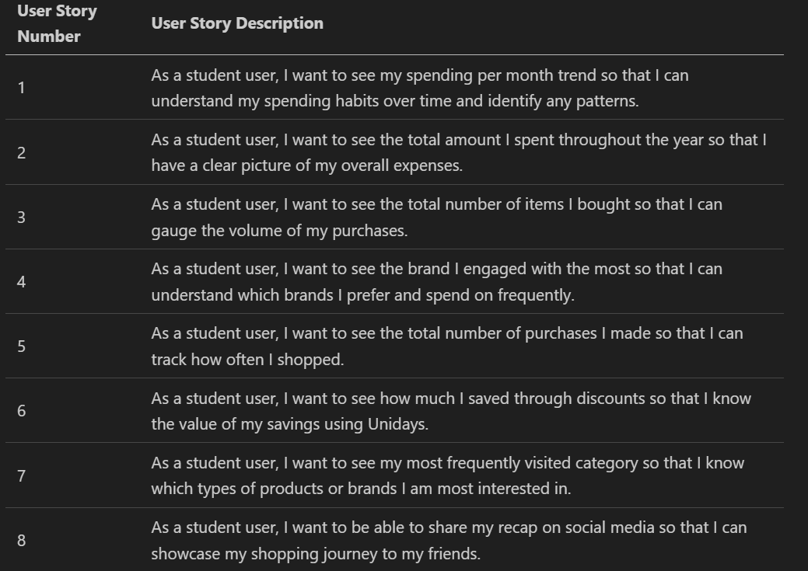

####   

## Design research

Our team decided to vote between Rubik, Gabarito and Afacad Flux as our main font for the project. The one that we chose was Gabarito as it was stylish and already similar to the font that UniDays uses on their website. We also decided the main colours that we should use for our page. The reason why we picked these colours is because they feature on the UniDays website so we thought that it would be quite synchronous with the website.

## Fonts and Colour Images

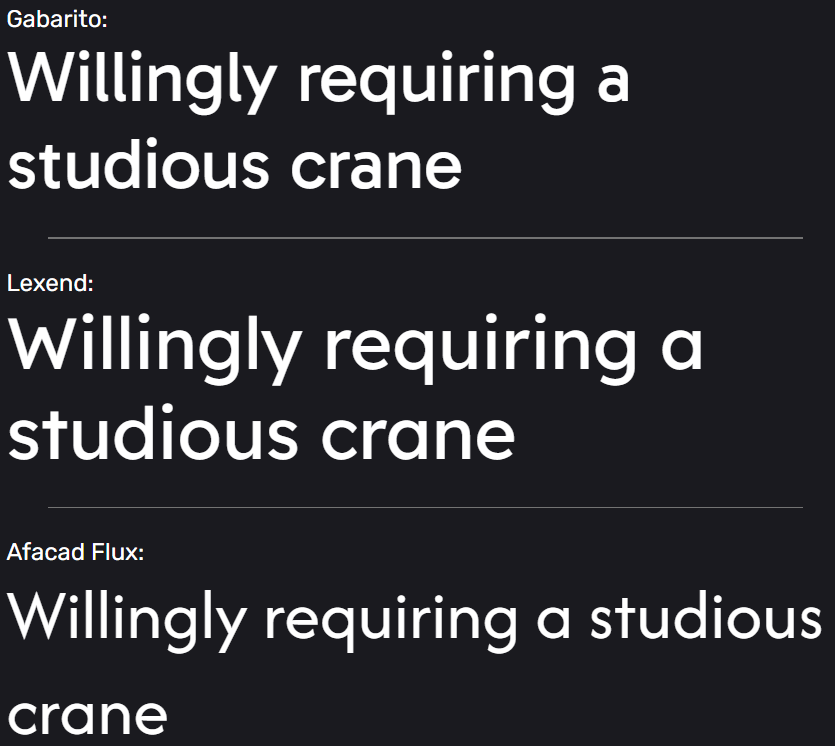 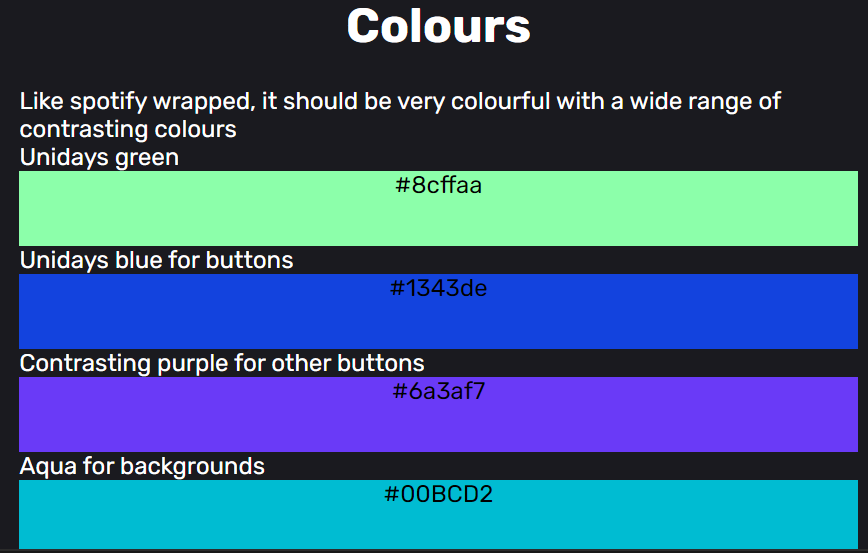

## Figma Designs Documentation

 We created some design mock-ups on figma of our frontend to flesh out some of our ideas and present them to the industry supervisors. When shown the designs, the supervisors were impressed by the professional nature and indicated that they would be a good starting point to begin initial development of the minimum viable product.

## Login page and Recapped page designs

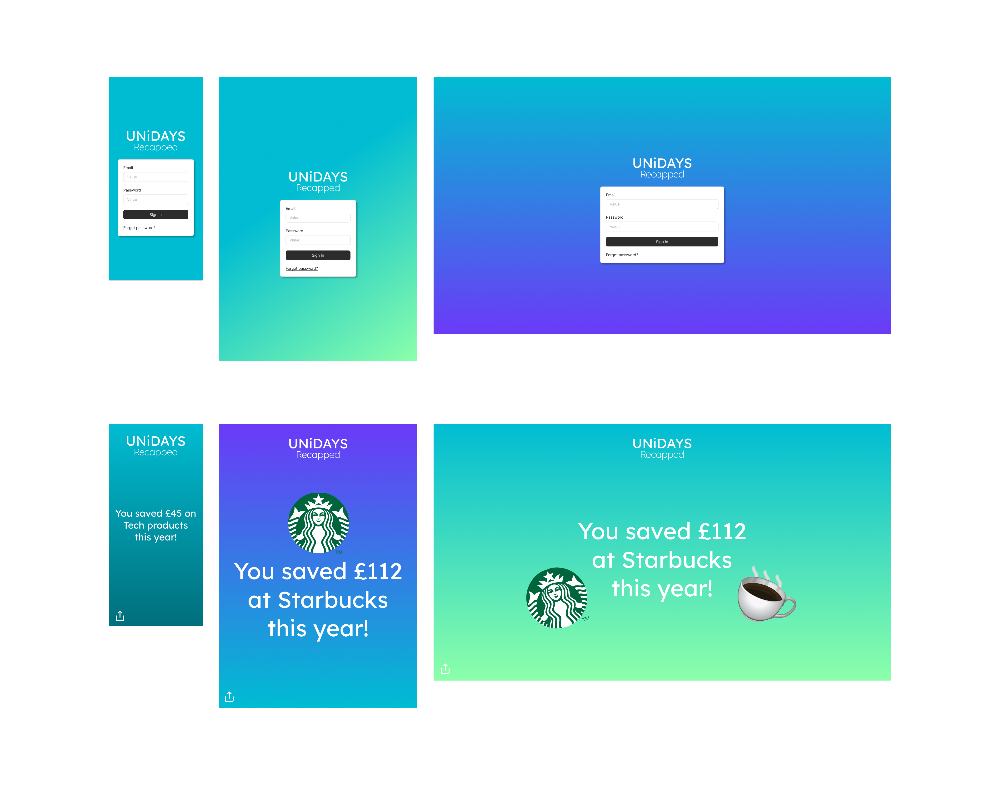

## Design Process

Our  team decided to take up the role of designing the mock-ups on figma.  since we had already used figma previously and we had designed the initial designs for the pitch video.

Considering that our supervisors liked the designs we showed in the pitch we decided that we would follow the theme of that design.

## Designs

[link to Perfecto's interactive main screen and info prototype designs on figma](https://www.figma.com/proto/VfzJUT4xBEDIAoMNwXwmRu/UNiDAYS-recapped?node-id=609-6&node-type=canvas&t=zeH0pB8YXtcmu88q-1&scaling=contain&content-scaling=fixed&page-id=602%3A9)

 #### Deskstop Main Page

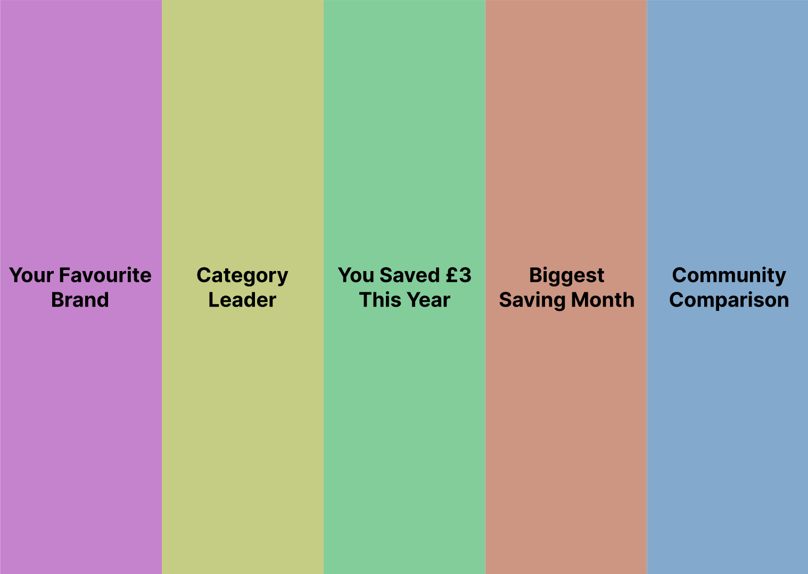

 #### Mobile Basic Page

 ## Frontend Technologies Research 

We had researched multiple technologies in order to implement the frontend development of our project. Although none of our team members had experience with React or TypeScript ,based on recommendations from our industry supervisors, we decided to explore them as an option and eventually choose them. We chose TypeScript instead of normal JavaScript for our project due to its use of explicit types, which enhances code readability and improves team collaboration by making the code more understandable. Furthermore,TypeScript helps prevent type-related errors at compile time, improving overall code reliability. Through our research, we discovered React’s focus on reusable components and found that its learning curve was not too steep, especially since it is a JavaScript library and we have prior experience with JavaScript. This led us to select React and TypeScript, along with HTML and CSS, as our main languages and tools for developing the front end of our project.

 ## Frontend Development

Using the designs as a template and model, we developed our first mock-up of our project. The UniDays login page implements the Gabarito font we had voted on and also contains the colours that we had chosen in a gradient in the background. There are two valid login credentials user1 (password1) and user2(password2). Once these are entered the user is navigated towards the Recapped page.

## Login page 

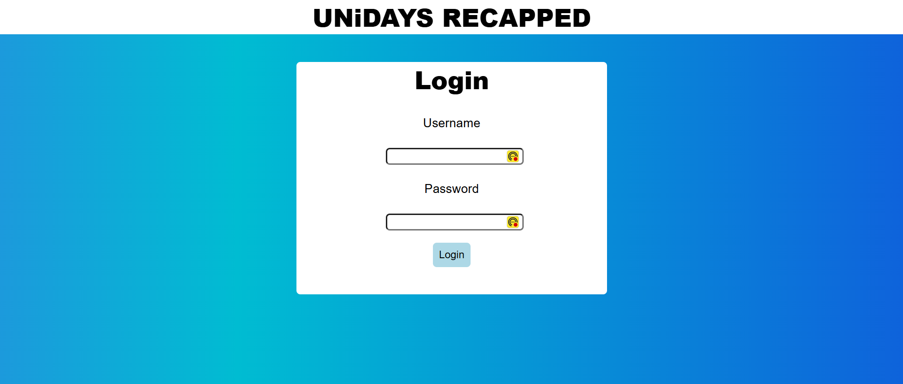 

 

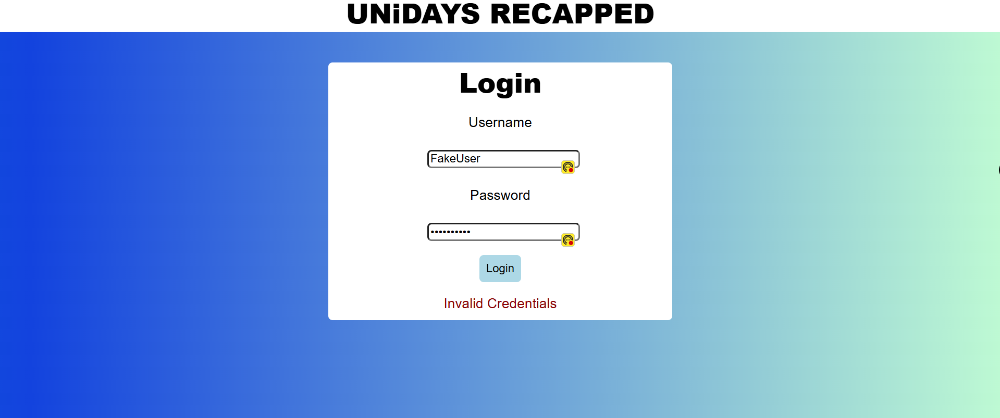 

## Recapped Page 

 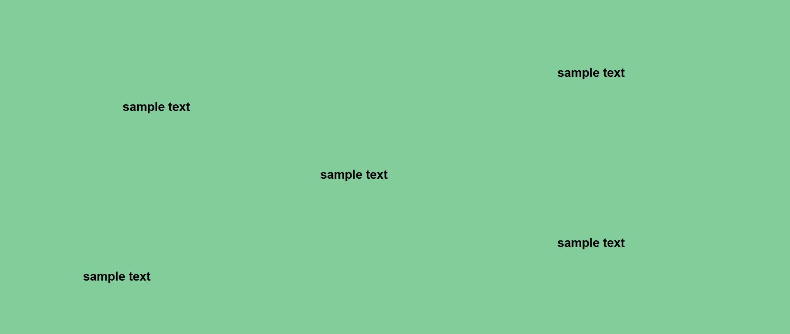

## Test Driven Development 

We have been using test driven development approach throughout the course of our project. For the Login page we have created 8 tests, of which 7 had been successful with one failing.

## Snippets of Login Test Code and results

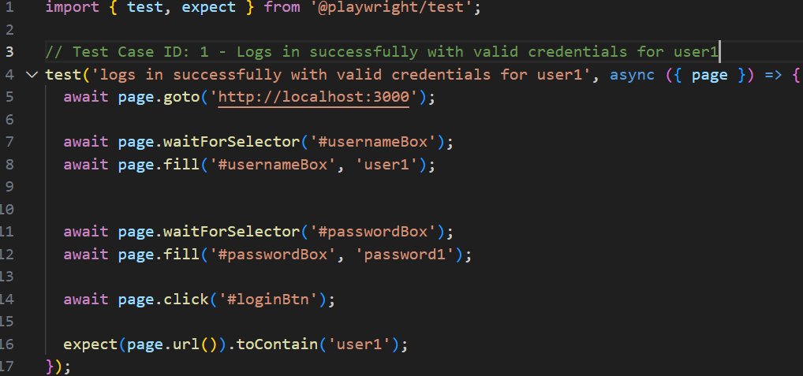

 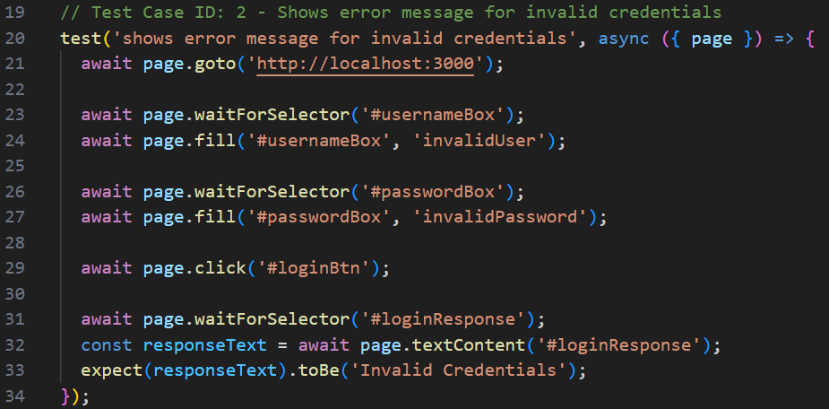

 

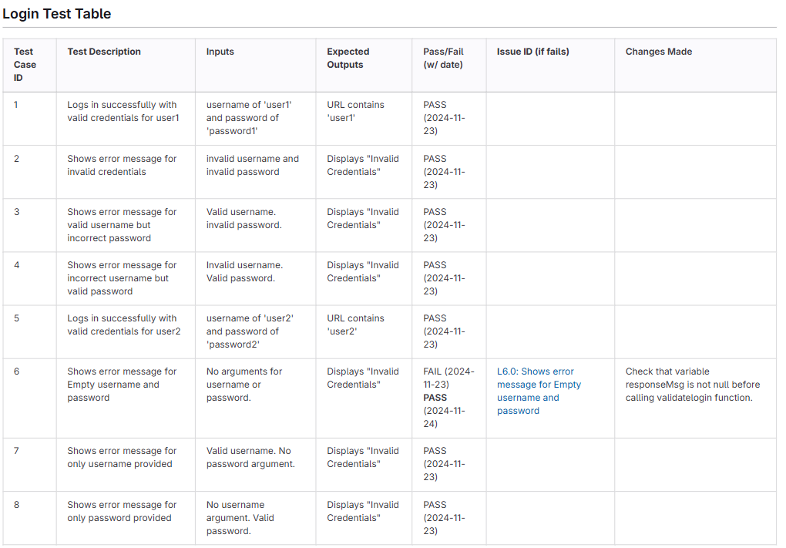

 ## Our Git Guidelines

So far in Gitlab, we have been using a main, dev, features branch and have been following guidelines on how to use them. The main contains the stable, production-ready code. All feature branches merge into dev only after code review and testing. The dev branch branches from main, it contains the development code where all feature branches merge. The features branch branches off of dev and is used when coding a specific feature or tests and must be merged into dev once that feature is complete. contains the development code and also tests where all feature branches merge. Do we have (GitLab CI/CD Integration). We also have an issue_id branch which is used when fixing specific issues/bugs identified on any branch. After fixing the issue, once reviewed, we must merge the branch back into the branch it originated from. (ask Luke about release branch, also ask how he did graph)

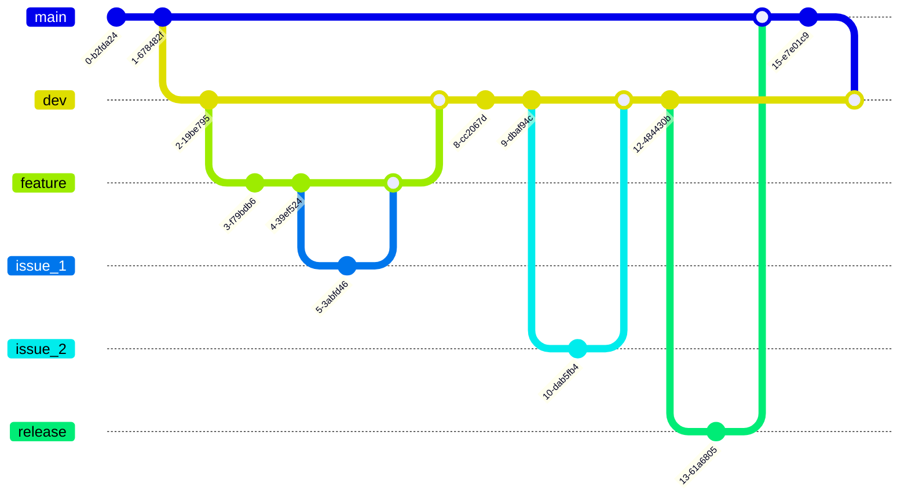

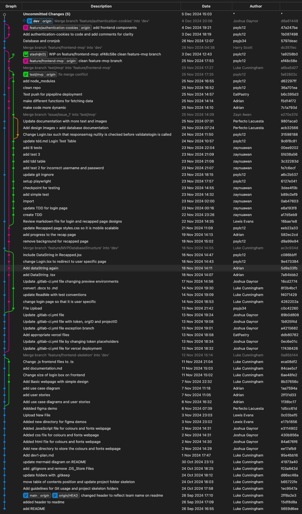

## Continuous integration and deployment
After researching numerous services which allow for continuous deployment and website hosting, we settled for Vercel, a web platform and cloud service which integrates well with react and next js libraries, many developer tools and is free to use for a project of this scale. Because the git platform we use is privately hosted by the university, the git cannot simply be connected to the Vercel project. Instead we have a pipeline which deploys to Vercel through a runner which is hosted on one of our machines using Docker. This ensures that whenever a merge is made to the dev or main branch, the new deployment is uploaded to Vercel to be hosted on a domain for the team to access and test it. 

This will also be useful for demonstrations to stakeholders and for the final demo day. It also allows us to see how the website responds to user traffic.

 